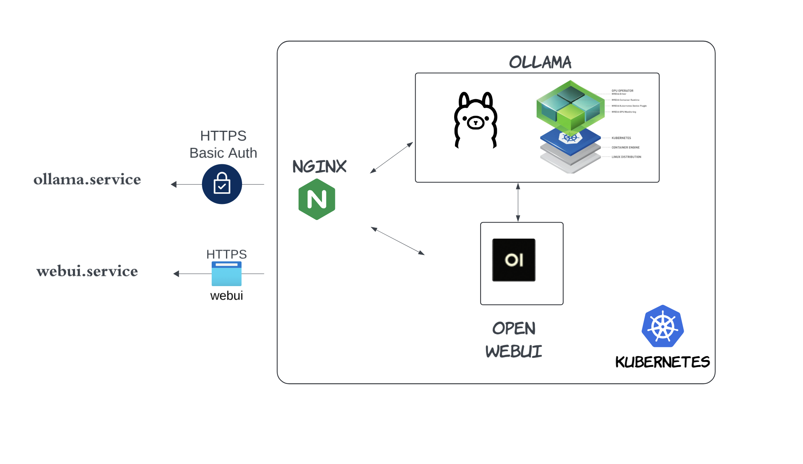
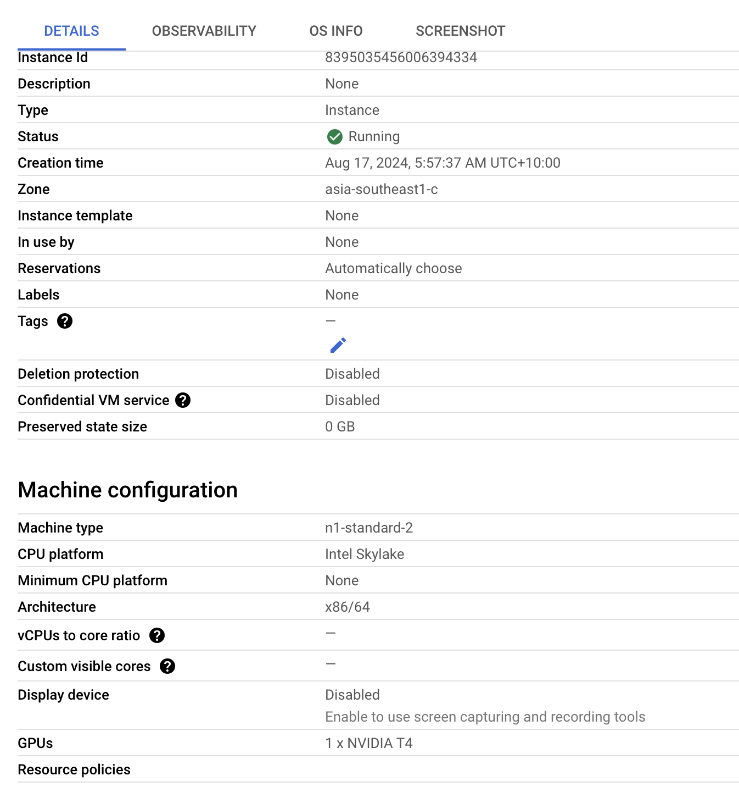
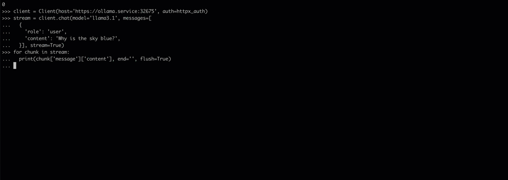

# Ollama-K8s-GPU
Host your own Ollama service in K8s. The Medium stories 
1. [Host Your Own Ollama Service in a Cloud Kubernetes (K8s) Cluster](https://medium.com/@yuxiaojian/host-your-own-ollama-service-in-a-cloud-kubernetes-k8s-cluster-c818ca84a055)
2. [Run Your Own OLLAMA in Kubernetes with Nvidia GPU](https://medium.com/@yuxiaojian/run-your-own-ollama-in-kubernetes-with-nvidia-gpu-8974d0c1a9df)
3. [Fine-Tuning Ollama Models with Unsloth](https://medium.com/@yuxiaojian/fine-tuning-ollama-models-with-unsloth-a504ff9e8002)

<p align="center">
  
</p>

### Set up a K8s in GCP
Credits to [cks-course-environment](https://github.com/killer-sh/cks-course-environment)

Set up the master node 
```bash
gcloud compute instances create ollama-master --zone=australia-southeast1-a \
--machine-type=e2-medium \
--image=ubuntu-2004-focal-v20240808 \
--image-project=ubuntu-os-cloud \
--boot-disk-size=50GB

gcloud compute ssh ollama-master

sudo -i
bash <(curl -s https://raw.githubusercontent.com/killer-sh/cks-course-environment/master/cluster-setup/latest/install_master.sh)
```

2. Create workers

```bash
gcloud compute instances create ollama-worker-1 --zone=australia-southeast1-a \
--machine-type=e2-standard-4 \
--image=ubuntu-2004-focal-v20240808 \
--image-project=ubuntu-os-cloud \
--boot-disk-size=50GB

gcloud compute instances create ollama-worker-2 --zone=australia-southeast1-a \
--machine-type=e2-standard-4 \
--image=ubuntu-2004-focal-v20240808 \
--image-project=ubuntu-os-cloud \
--boot-disk-size=50GB


sudo -i
bash <(curl -s https://raw.githubusercontent.com/killer-sh/cks-course-environment/master/cluster-setup/latest/install_worker.sh)

# Copied from the master node output
kubeadm join 10.152.0.4:6443 --token xxxx --discovery-token-ca-cert-hash sha256:xxx

```

## Create a K8s cluster with a GPU worker

GPU node is not always available. After some attempts, created a GPU node in Singapore region
<p align="center">
  
</p>

Then create the master node in a region where GPU is available. 
```bash
gcloud compute instances create ollama-master-gpu --zone=asia-southeast1-c \
--machine-type=e2-medium \
--image=ubuntu-2004-focal-v20240808 \
--image-project=ubuntu-os-cloud \
--boot-disk-size=50GB

sudo -i
bash <(curl -s https://raw.githubusercontent.com/killer-sh/cks-course-environment/master/cluster-setup/latest/install_master.sh)
```

It's much faster and smoother with GPU
<p align="center">
  
</p>


### Install GPU Driver
```bash
$ apt install ubuntu-drivers-common
$ ubuntu-drivers devices
$ ubuntu-drivers autoinstall

$ reboot
$ nvidia-smi
Mon Aug 19 23:50:42 2024
+---------------------------------------------------------------------------------------+
| NVIDIA-SMI 535.183.01             Driver Version: 535.183.01   CUDA Version: 12.2     |
|-----------------------------------------+----------------------+----------------------+
| GPU  Name                 Persistence-M | Bus-Id        Disp.A | Volatile Uncorr. ECC |
| Fan  Temp   Perf          Pwr:Usage/Cap |         Memory-Usage | GPU-Util  Compute M. |
|                                         |                      |               MIG M. |
|=========================================+======================+======================|
|   0  Tesla T4                       Off | 00000000:00:04.0 Off |                    0 |
| N/A   62C    P8              10W /  70W |     70MiB / 15360MiB |      0%      Default |
|                                         |                      |                  N/A |
+-----------------------------------------+----------------------+----------------------+

+---------------------------------------------------------------------------------------+
| Processes:                                                                            |
|  GPU   GI   CI        PID   Type   Process name                            GPU Memory |
|        ID   ID                                                             Usage      |
|=======================================================================================|
|    0   N/A  N/A      1080      G   /usr/lib/xorg/Xorg                           59MiB |
|    0   N/A  N/A      1628      G   /usr/bin/gnome-shell                          7MiB |
+---------------------------------------------------------------------------------------+

```

### Basic Authentication
Create [Basic Authentication](https://kubernetes.github.io/ingress-nginx/examples/auth/basic/) secret for Ingress-Nginx Controller 
```bash
$ apt install -y apache2-utils

$ htpasswd -c auth ollama
New password:
Re-type new password:
Adding password for user ollama

$ kubectl create secret generic basic-auth --from-file=auth -n ollama
```

## Test with python
- LangChain Ollama
```python
>>> from langchain_community.llms import Ollama
>>> from requests.auth import HTTPBasicAuth
>>>
>>> auth=HTTPBasicAuth('ollama', 'xxxxxxx')
>>>
>>> ollama = Ollama(
...     base_url='https://ollama.service:32559',
...     model="llama3.1",
...     auth=auth
... )
>>> print(ollama.invoke("why is the sky blue"))


The sky appears blue to us during the day due to a phenomenon called scattering of light. Here's why:

**Scattering of Light**

When sunlight enters Earth's atmosphere, it encounters tiny molecules of gases such as nitrogen (N2) and oxygen (O2). These molecules are much smaller than the wavelength of visible light, so they scatter the light in all directions.

**Why Blue Light is Scattered More**

Now, here's the crucial part: shorter wavelengths of light (like blue and violet) are scattered more than longer wavelengths (like red and orange). This is because the tiny molecules are more effective at scattering the shorter wavelengths. This phenomenon is known as Rayleigh scattering, named after the British physicist Lord Rayleigh who first described it in the late 19th century.

**Blue Light Dominates**

As a result of this scattering, the blue light is distributed throughout the atmosphere and reaches our eyes from all directions. Our brains then perceive this scattered blue light as the color of the sky during the day. The exact shade of blue can vary depending on atmospheric conditions, such as pollution levels, dust particles, or water vapor content.

**Why Not Violet?**

You might wonder why we don't see violet instead of blue. There are a few reasons for this:

1. **Sensitivity to Blue**: Our eyes are more sensitive to blue light than violet light.
2. **Atmospheric Absorption**: The atmosphere absorbs some violet light, making it less visible to us.
3. **Brain Perception**: Our brains process the scattered blue light and perceive it as blue, rather than violet.

So, to summarize: the sky appears blue due to the scattering of sunlight by tiny molecules in the atmosphere, with shorter wavelengths (like blue) being scattered more than longer wavelengths (like red).
```

- Ollama-python
```python
>>> from ollama import Client
>>> import httpx
>>> httpx_auth = httpx.BasicAuth(username="ollama", password="xxxxx")
>>> client = Client(host='https://ollama.service:32559', auth=httpx_auth)
>>> stream = client.chat(model='llama3.1', messages=[
...   {
...     'role': 'user',
...     'content': 'Why is the sky blue?',
...   }], stream=True)
>>>
>>> for chunk in stream:
...   print(chunk['message']['content'], end='', flush=True)
...
The sky appears blue to us because of a phenomenon called scattering, which occurs when sunlight interacts with the tiny molecules of gases in the atmosphere. Here's a simplified explanation:

1. **Sunlight**: The sun emits white light, which contains all the colors of the visible spectrum (red, orange, yellow, green, blue, indigo, and violet).
2. **Atmospheric particles**: When sunlight enters our atmosphere, it encounters tiny molecules of gases such as nitrogen (N2) and oxygen (O2). These molecules are much smaller than the wavelength of light.
3. **Scattering**: The shorter wavelengths of light, like blue and violet, are scattered in all directions by the atmospheric particles. This is known as Rayleigh scattering, named after the British physicist Lord Rayleigh who first described it in 1871.
4. **Dominant color**: Because blue light is scattered more than any other color, it reaches our eyes from all directions, giving the sky its blue appearance.

Some additional factors contribute to the exact shade of blue we see:

* **Time of day**: During sunrise and sunset, the sky can take on hues of red and orange due to a phenomenon called Mie scattering. This occurs when light encounters larger particles like dust and water droplets.
* **Atmospheric conditions**: Pollution, dust, and water vapor in the atmosphere can affect the scattering process, changing the apparent color of the sky.
* **Observer's perspective**: The angle at which we view the sky also influences its apparent color. When the sun is directly overhead (around noon), the sky appears a deeper blue.

In summary, the sky appears blue because shorter wavelengths of light are scattered in all directions by atmospheric particles, making blue visible to our eyes more prominently than any other color!
```